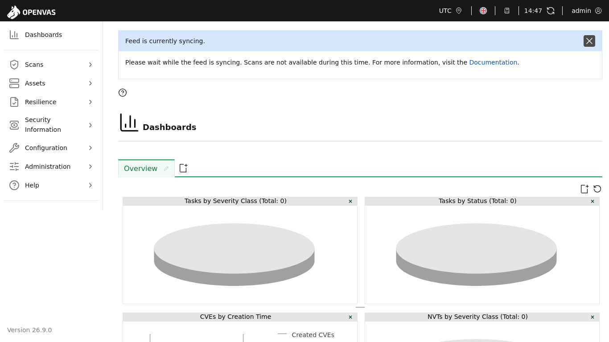
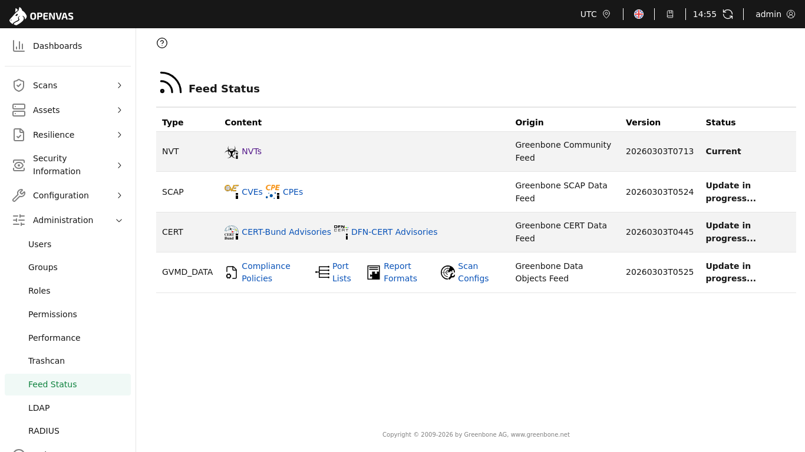

# Vulnerability Management & Reports

---

## 1.Installation of Vulnerability Scanner

### 1.1.GVM (Greenbone Vulnerability Management)

* `sudo apt install gvm`

* `sudo gvm-setup`

* `sudo gvm-check-setup`

### 1.2.OpenVAS (Open Vulnerability Assessment Scanner)

* `sudo gvm-start`

* `https://127.0.0.1:9392`

* `sudo systemctl status gvmd`

### 1.3.Checking Feed Status

* `sudo systemctl status ospd-openvas`

* `sudo systemctl status redis-server`

* `sudo systemctl status postgresql`

* `sudo gvmd --get-scanner`

* `sudo gvmd --get-freeds-status`

### 1.4.Service Logs

* `sudo journalctl -u gvmd -f`

### 1.5.Database Status

* `sudo greenbone-feed-sync --type NVT`

* `sudo greenbone-feed-sync --type SCAP`
 
* `sudo greenbone-feed-sync --type CERT`

---

**OpenVAS Project Note: Hardware & Resource Limit**

* Due to technical limitations, the network scanning phase using OpenVAS was documented but not fully executed.

* **Storage & Database Volume:** OpenVAS requires a massive initial download of over 50,000 Network Vulnerability Tests (NVTs). The local environment reached its storage capacity during the sync process.

* **Hardware Intensity:** The synchronization and scanning process are highly CPU and RAM intensive. Running OpenVAS alongside the Wazuh Manager and multiple VMs exceeded the available hardware resources.

* **Operational Decision:** To maintain the stability of the existing Wazuh monitoring environment, the OpenVAS update was halted.

* **Lesson Learned:** In a professional SOC environment, network scanners like OpenVAS are typically deployed on dedicated servers with high-speed storage (SSD) and significant RAM to handle the heavy database processing required for accurate vulnerability feeds.
