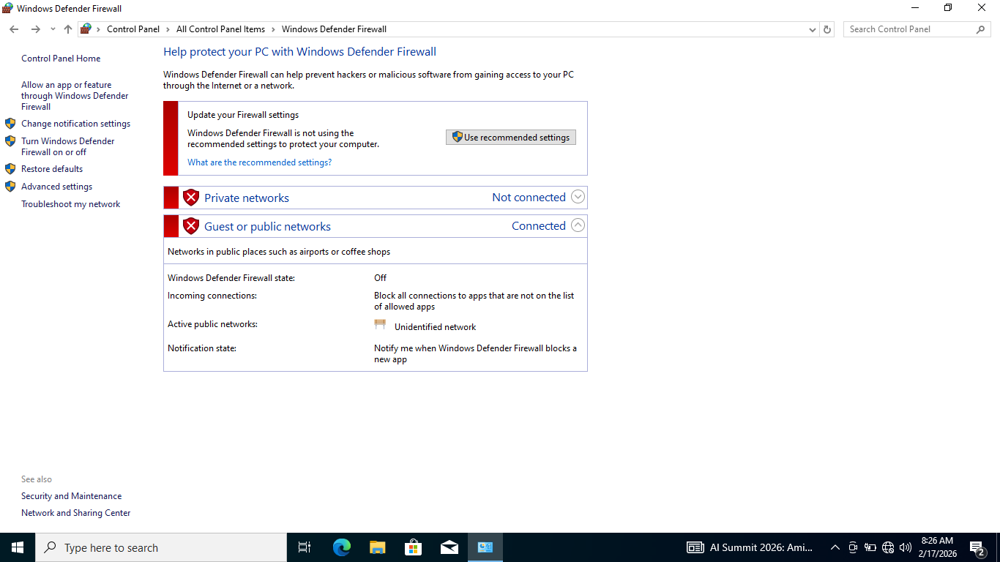
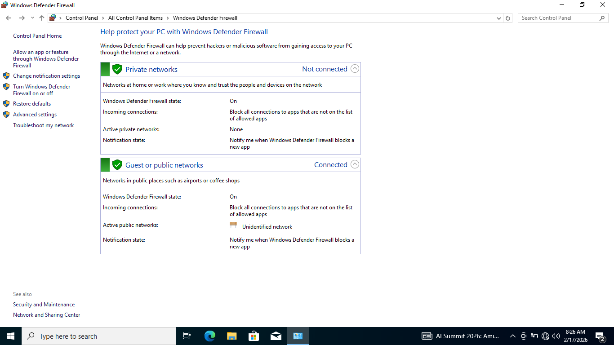
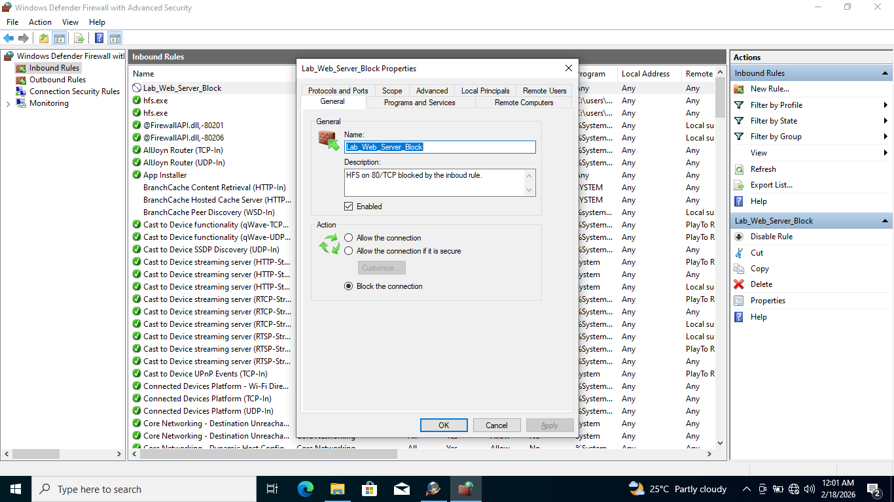
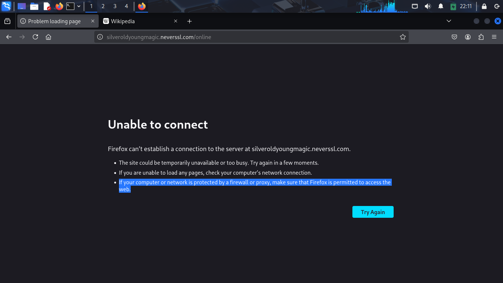
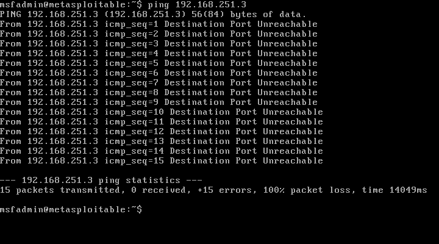

# Firewall Configuration and Rule Setup
---
## 1.Nmap scan on metasploitable 2

* **Action & Objective:** Performed a 'Full Port Discovery' scan. This allowed to map out all active services on the Metasploitable VM. By identifying open ports like 21 (FTP) and 80 (HTTP)

* **Result:** [Nmap report for metasploitable port scan](./scan_reports/nmap_meta_scan.txt)

* **Lesson:** Without a firewall, any user on the network can see every service running on the server. This proves that a firewall is the first and most important layer of defense to hide sensitive ports.

---

 ## 2.Windows Defender Firewall

 ### 2.1.Nmap scan on Windows (no firewall)

**Action & Objective:** Disabling the Windows Firewall to demonstrate how an unprotected host exposes its services and increases the attack surface during an Nmap discovery scan.

**Result:** [Nmap report for windows port scan](./scan_reports/nmap_win_scan.txt)

### 2.2.Nmap scan on Windows (firewall)

**Action & Objective:** Enabling the Windows Firewall to demonstrate how active filtering controls port visibility and blocks unauthorized Nmap discovery scans.

**Result:** [Nmap report for windows port scan](./scan_reports/nmap_win_fscan.txt)

### 2.3.Nmap scan on port 80 without rule

**Action & Objective:** Performed a Nmap 'Port' scan to see the active services running on ports 80 (HTTP), to demonstrate how the service is allowed to run without the firewall.

**Result:** [Nmap report for windows port scan](./scan_reports/win_hfs_scan.txt)

### 2.4.Nmap scan on port 80 with rule

**Action & Objective:** Performed a Nmap 'Port' scan to see how the services running on ports 80 (HTTP), after applying the firewall rule in the HFS service in inbound rules inside the windows defender firewall.

**Result:** [Nmap report for windows port scan](./scan_reports/win_hfs_fscan.txt)

---

## 3.Linux ufw Firewall

### 3.1.Setting up the ufw

* `ufw status`
* `ufw enable`  
* `sudo ufw default deny incoming`
* `sudo ufw default allow outgoing`

### 3.2.Custom rules (Inbuoud/Outboud)

* `sudo ufw allow ssh`
* `sudo ufw deny 80/tcp`
* `sudo ufw deny from 192.168.251.5`
* `sudo ufw reject out to 192.168.251.11`

### 3.3.Blocking the HTTP

**Action:** Executed the command `sudo ufw deny out 80/tcp` to block on all unencrypted outbound HTTP traffic.

**Result:** The firewall successfully blocked the http connection

### 3.4.Blocking the IP from ICMP request

**Action:** Executed the command `sudo ufw reject from 192.168.251.5` to block the icmp from the metasploitable 2.

*  _**Master rule:** UFW uses a special rule book, it's a file called_ **before.rules**. _This file tells the firewall "Allow these basic things like Ping._
 
*  _**Fix:** Edit the ICMP Rules by telling UFW to stop automatically saying "Yes" to pings._

* _**Global rule:** Open the configuration file_ `sudo nano /etc/ufw/before.rules`. _Change the_ **-A ufw-before-input -p icmp --icmp-type echo-request -j ACCEPT** _to_ **-A ufw-before-input -p icmp --icmp-type echo-request -j REJECT** _in ok icmp codes for INPUT. Type_ `sudo ufw reload` _to apply the new global rule._

* [Rulebook](./config/before.rules)

**Result:** The firewall successfully blocked the icmp request

---

## 4.Key Lesson

