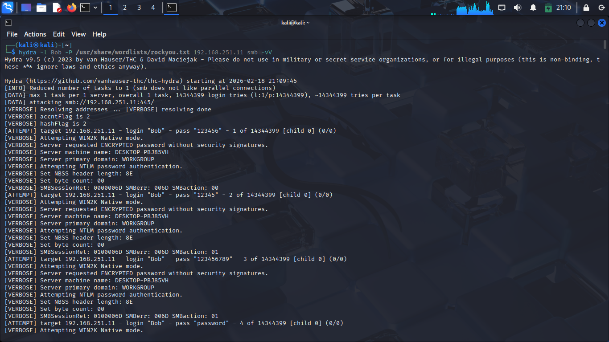
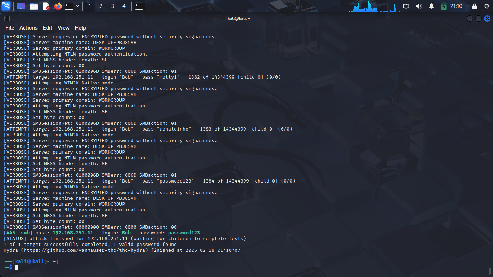
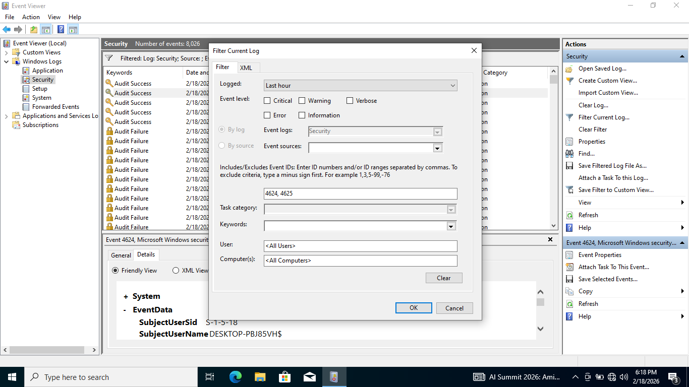
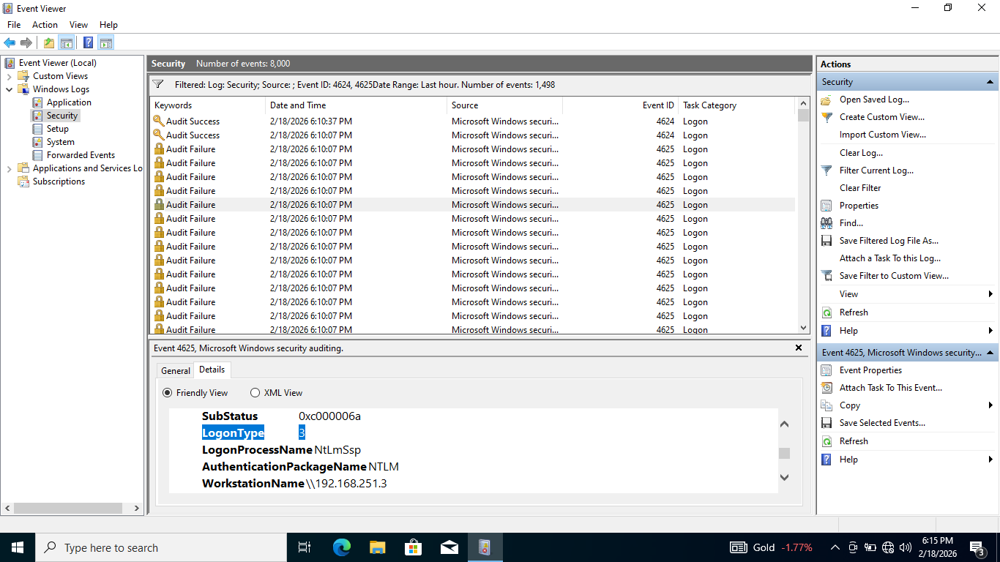

# Log Analysis: Linux & Windows

---
## 1.Linux Log: Metasploitable 2

### 1.1.Dictionary Attack on FTP Service (21)

* **Objective:** To verify that the target's security logs accurately, capturing high-volume failed login attempts and identify the attack source by looking through the logs.

* **Attack Execution:** Executed the Hydra command to point a wordlist (unix_passwords.txt) and the user (msfadmin) at the target IP: `hydra -l msfadmin -P /usr/share/wordlists/metasploit/unix_passwords.txt 192.168.251.5 ftp -vV`.

* **Log Retrieval and Analysis:** The authentication logs were exported from Metasploitable 2 using the command `cat /var/log/vsftpd.log | tail -n 100 > ftp_attack.txt`.

* [Linux Log](./logs/ftp_attack.txt)

### 1.2.Deep Log Analysis: Identification and Forensics

**Log Report**

* Wed Feb 18 08:29:01 2026 [pid 5219] [msfadmin] FAIL LOGIN: Client "192.168.251.3"
* Wed Feb 18 08:29:01 2026 [pid 5222] [msfadmin] FAIL LOGIN: Client "192.168.251.3"
* Wed Feb 18 08:29:01 2026 [pid 5224] [msfadmin] FAIL LOGIN: Client "192.168.251.3"
* Wed Feb 18 08:29:01 2026 [pid 5226] [msfadmin] FAIL LOGIN: Client "192.168.251.3"
* Wed Feb 18 08:29:01 2026 [pid 5228] [msfadmin] FAIL LOGIN: Client "192.168.251.3"
* **Wed Feb 18 08:29:02 2026 [pid 5204] [msfadmin] OK LOGIN: Client "192.168.251.3"**
* Wed Feb 18 08:29:04 2026 [pid 5198] [msfadmin] FAIL LOGIN: Client "192.168.251.3"
* Wed Feb 18 08:29:04 2026 [pid 5200] [msfadmin] FAIL LOGIN: Client "192.168.251.3"
* Wed Feb 18 08:29:04 2026 [pid 5201] [msfadmin] FAIL LOGIN: Client "192.168.251.3"

**Evidence Analysis**

* **Attacker Identification (The "Who"):** The logs consistently record the source as Client "192.168.251.3". This confirms that all attempts originated from a single host (the Kali Linux machine) on the local network.

* **Account Targeting (The "Whom"):** The attacker specifically targeted the msfadmin account. Since the logs show repeated attempts on a single username, this is classified as a targeted dictionary attack rather than a wide-spread "password spraying" attack.

* **The Compromise (The "What Happened"):** The Failures: At 08:29:01, multiple threads (PIDs 5219, 5222, etc.) were rejected by the system, resulting in FAIL LOGIN entries.

* **The Success:** At exactly 08:29:02, the log records OK LOGIN for PID 5204.

* _**Conclusion:** It is important to note that a few FAIL LOGIN entries appear after the OK LOGIN. This is a characteristic of an automated tool like Hydra. Because Hydra runs multiple "threads" in parallel, several incorrect guesses were already being processed by the server at the exact moment the correct password was found. This indicates that the tool successfully matched a password from the wordlist to the msfadmin account, granting the attacker full FTP access._

---

## 2.Windows Log: Event Viewer

### 2.1. Dictionary Attack on SMB Service (445)

* **Action & Objective:** In this scenario, a dictionary attack was performed against the Windows target using the SMB (Server Message Block) protocol. SMB is commonly used for file sharing.

* **Attack Command:** `hydra -l Bob -P /usr/share/wordlists/rockyou.txt 192.168.251.11 smb -vV`

* **Log Exporting:** Finding the failed logons (4625) in the security and exporting as .evtx file.

[Windows log](./logs/wine.evtx)

### 2.2.Deep Log Analysis: Identification and Forensics

**Log Report**

