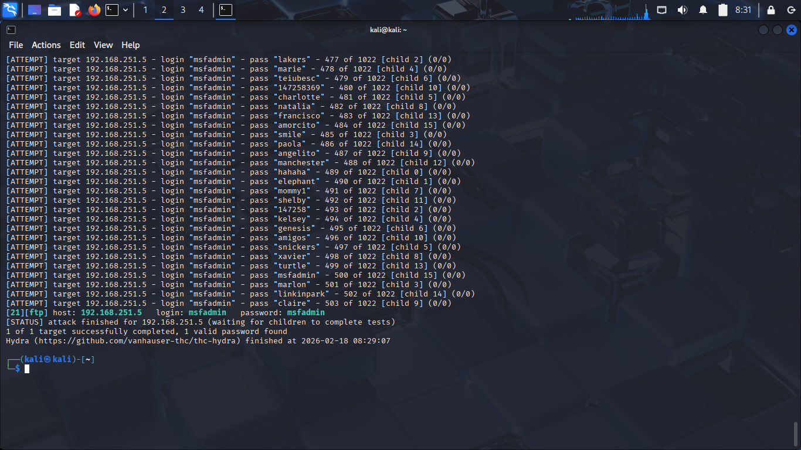

# Log Analysis: Linux & Windows

---
## 1.Linux Log: Metasploitable 2

### 1.1.Dictionary Attack on FTP Service

* **Objective:** To verify that the target's security logs accurately, capturing high-volume failed login attempts and identify the attack source by looking through the logs.

* **Attack Execution:** Executed the Hydra command to point a wordlist (unix_passwords.txt) and the user (msfadmin) at the target IP: `hydra -l msfadmin -P /usr/share/wordlists/metasploit/unix_passwords.txt 192.168.251.5 ftp -vV`.

* **Log Retrieval and Analysis:** The authentication logs were exported from Metasploitable 2 using the command `cat /var/log/vftpd.log | tail -n 100 > ftp_attack.txt`.

* [Linux Log](./logs/ftp_attack.txt)

### 1.2.Deep Log Analysis: Identification and Forensics
