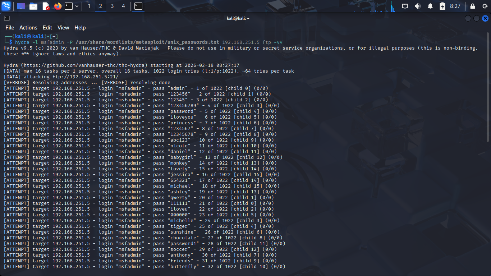

# Log Analysis: Linux & Windows

---
## 1.Linux Log: Metasploitable 2

### 1.1.Dictionary Attack on Telnet Service

* **Objective:** To verify that the target's security logs accurately, capturing high-volume failed login attempts and identify the attack source using the too Hydra.

* **Attack Execution** Executed the Hydra command to point a wordlist (rockyou.txt) at the target IP: `hydra -l admin -P /usr/share/wordlists/rockyou.txt 192.168.251.5 telnet -vV`.

* **Log Retrieval and Analysis:** The authentication logs were exported from Metasploitable 2 using the command `cat /var/log/auth.log | grep "telnet" | tail -n 200 > telnet_attack.txt`.

* [Linux Log](./logs/telnet_attack.txt)

### 1.2.Deep Log Analysis: Identification and Forensics
