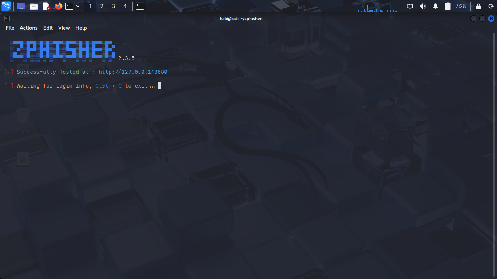
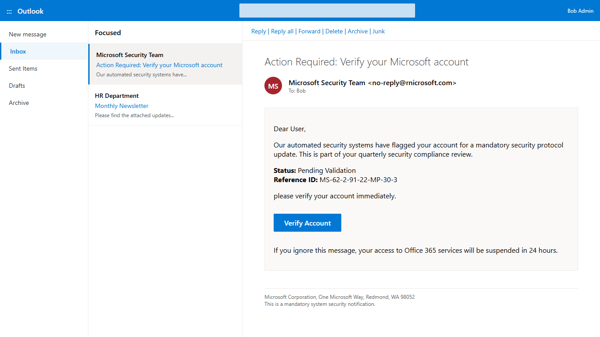
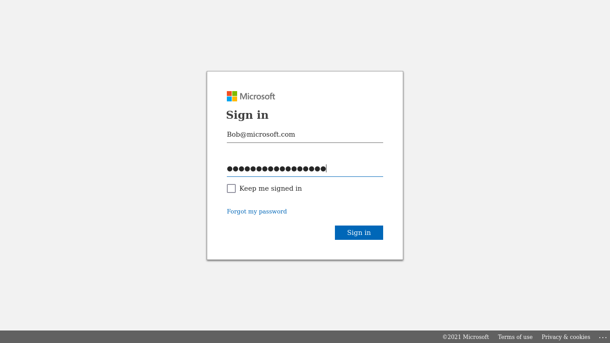
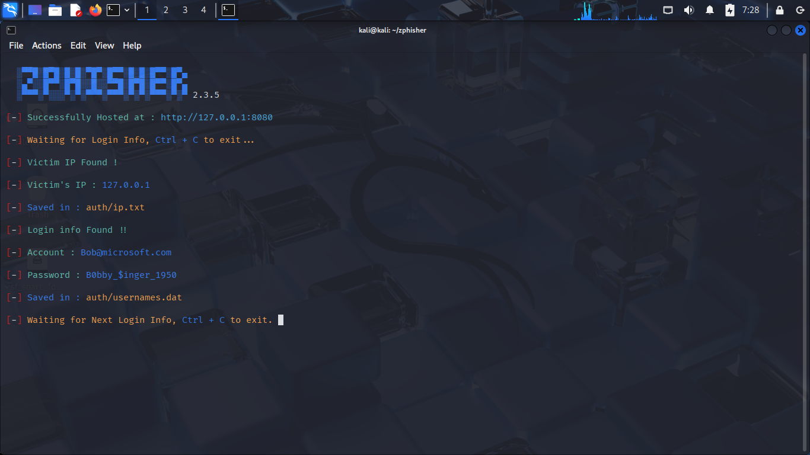

# Phishing Simulation

---

## 1.Phishing Campaign

### 1.1.The Lifecycle of a Phishing Attack

1. **Goal Setting:** The attacker decides what information they want, such as a username and password, and chooses a specific group of people to target.

2. **Building the Deception:** A fake email is created using real company logos and professional formatting to make the message look authentic.

3. **Creating Urgency:** The message uses "Social Engineering" to scare the user, often claiming there is a technical emergency or a short deadline to force a fast decision.

4. **Setting the Trap:** The email contains a link to a "Credential Harvester," which is a fake website designed to look exactly like a real login page.

5. **Stealing the Data:** Once the victim enters their credentials, the data is saved to the attacker's server.

### 1.2.The Danger of Social Engineering

Social Engineering is so dangerous in phishing because it creates a 'Technical Blind Spot,' tricking the user into clicking a malicious link using authority, urgency, sympathy, greed, and threats. The most dangerous part of phishing is Human Error. Unlike a computer, humans cannot be 'patched' with a security update. A software update can fix a broken program, but it cannot fix a person's feelings of panic or trust. When an email creates a fake emergency, the human brain often ignores small warning signs in favor of immediate action.

### 1.3.The Mobile Threat Landscape
It is important to note that Android and iOS users are the most frequently targeted by phishing attacks in the modern threat landscape.

Because smartphones are used globally in everyday life including banking, social media, and communication. They provide a "quick view" of emails that users often check while distracted. Unlike a "bulky" desktop computer, the small screen of a mobile device makes it harder for a user to inspect suspicious URLs or sender addresses.

Since mobile operating systems like Android and iOS operate within a strict Linux-based sandbox environment, they are traditionally more stronger against classic file-based malware and computer viruses. As a result, threat actors have shifted their strategy. Instead of trying to exploit the device's software, they focus on Identity Theft. By exploiting the "Human Factor," attackers aim to steal the user's credentials (username and password) directly, bypassing the device's technical security entirely.

---

## 2.Credential Harvester & Terminal Emulation

### 2.1.Attacker POV (The "Hook")

* **Action:** The attacker crafts a "Security Alert" email using a phishing framework (Zphisher).

* **The Goal:** Bypass the user's suspicion by using Urgency and Authority.

* [**Email Template**](./folder/index.html)

### 2.2.User POV (The "Catch")

* **Action:** The user receives the email on their device and, seeing the "Emergency" alert and clicks the link.

* **The Experience**: The user sees a perfect clone of a Microsoft login page.

### 2.3.Backend Result (The "Harvest")

* **Action:** The user’s username and password are captured by the attacker's script.

* **Clean-up:** Redirecting the user to the original site to cover up the phishing.

* [**IP Address of victim**](./folder/ip.txt)

* [**User & Password of victim**](./folder/usernames.dat)

---

## 3.Social Awareness of Suspicious Mail

