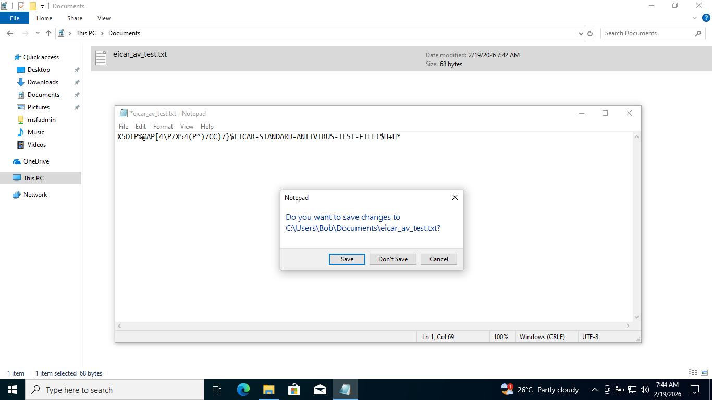
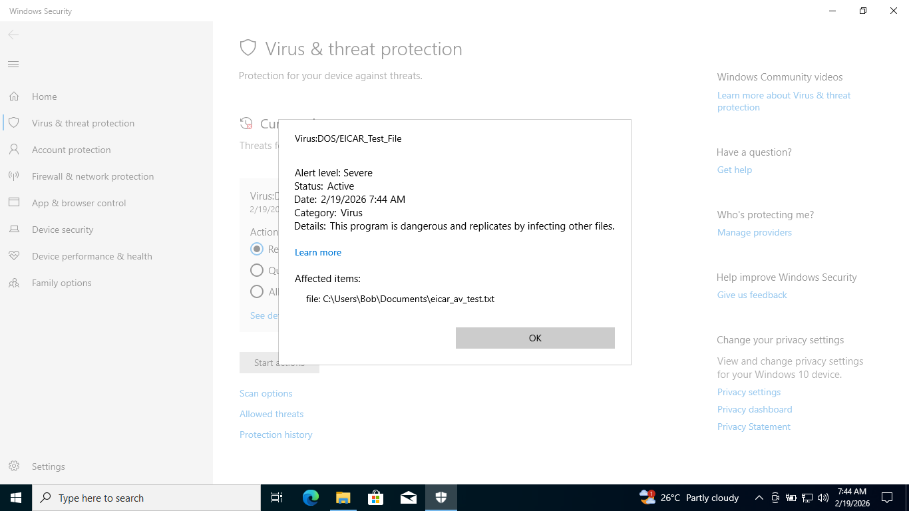
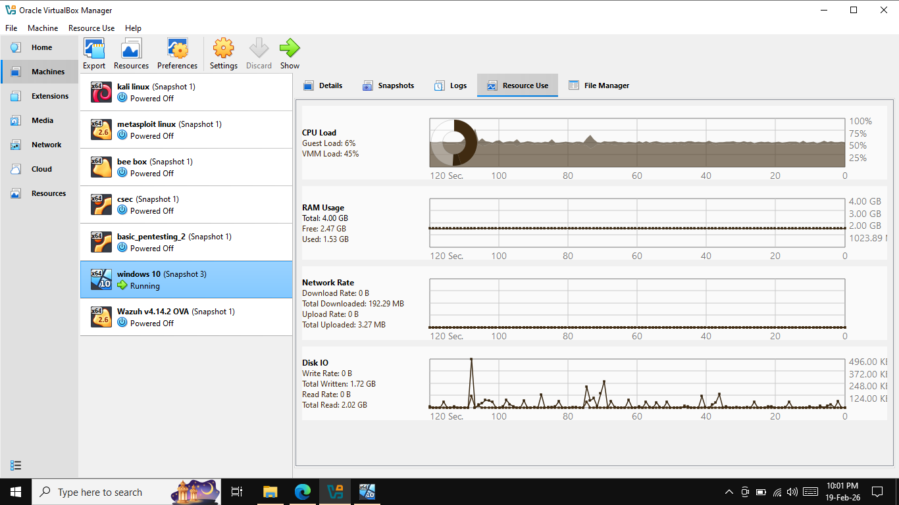
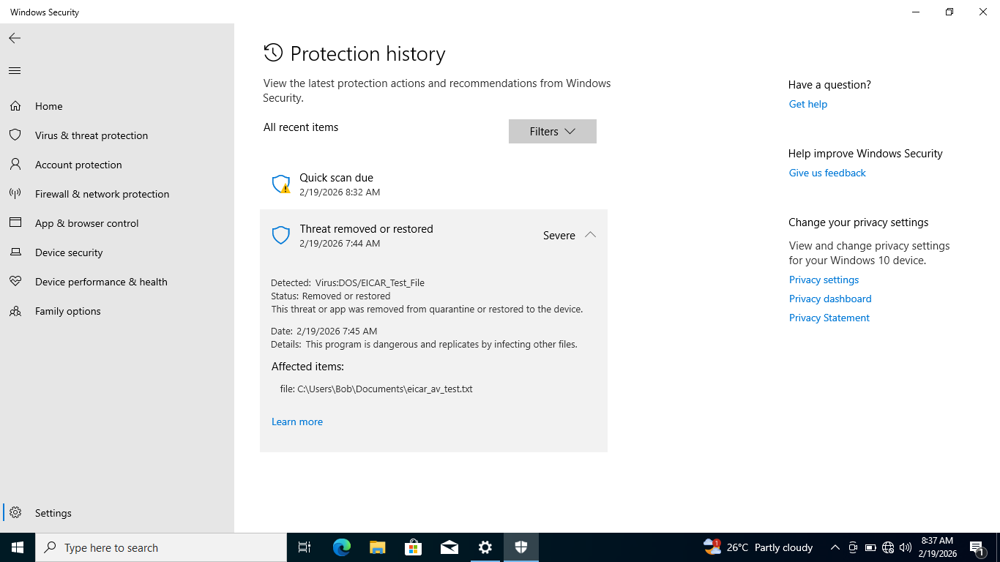
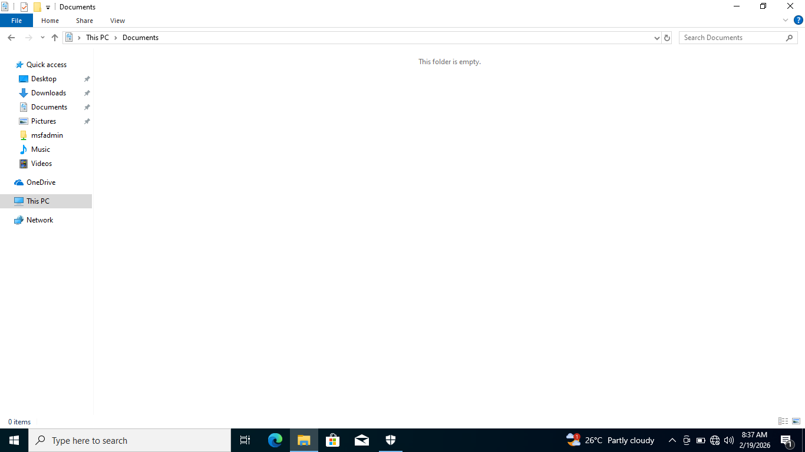

# Threat Detection & Incident Response

---
## 1.Host-Based Threat Detection

### The EICAR Test String:

* **EICAR:** The EICAR string is a standardized, 68-byte ASCII text string used to test antivirus software functionality without using real malware.
  `RUS-TEST-X5O!P%@AP[4\PZX54(P^)7CC)7}$EICAR-STANDARD-ANTIVIFILE!$H+H*`
  
* **Objective:** To validate the effectiveness of the Windows Defender real-time protection.

* **Action:** Creating a new file [**eicar_av_test.txt**](./folder/eicar_av_test.txt) in the document folder, to trigger the windows defender. **To perform the SANS Incident Response Process.**

* **Result:** Windows Defender successfully detected the file as therat.

## 2.SANS Incident Response

**Objective:** To demonstrate the SANS PICER (Preparation, Identification, Containment, Eradication, Recovery) framework by simulating a malware infection using a standardized EICAR test.

### 2.1.Preparation

* Manually created a text file containing the EICAR test string and saved in the document folder, Windows Defender Real-Time Protection was active and ready to monitor the system.

### 2.2.Identification (Detection & Analysis)

* Windows Defender immediately flagged the file as a "Severe" threat and blocked access to it. Manually confirmed the detection by checking the Protection History. this proved that the automated defense system successfully recognized the malicious signature.

### 2.3.Containment

* Even though the file was created locally, A Network Isolation is performed to simulate a standard response protocol. Manually disabled the network adapter on the Windows VM to "cut off" the machine from the rest of the lab environment and quarantined the malious file.

### 2.4.Eradication

* Used Windows Defender to officially "Remove" the quarantined EICAR file.

### 2.5.Recovery

* Restored the system to a fully operational state by re-enabling the network adapter and restoring internet connectivity. Performed a final "Full Scan" with Windows Defender to confirm that the environment was clean and stable. No further alerts were triggered, indicating that the system was safe for normal use.

### 2.6.Lessons Learned

* This test confirmed that our Endpoint Protection (AV) is working correctly by watching file-write operations. A key lesson is that security isn't just about the "Firewall" it’s about the Antivirus catching threats that are created or moved manually on the disk.
