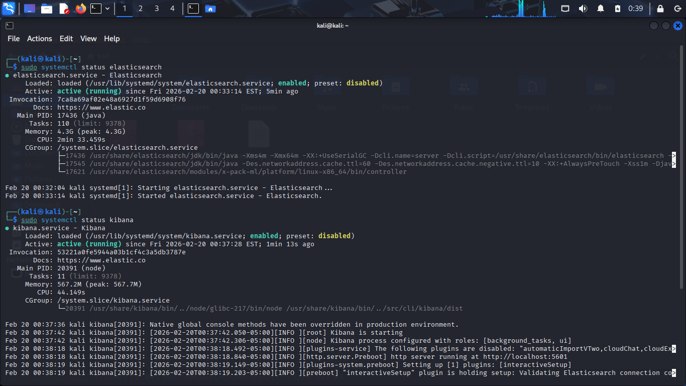
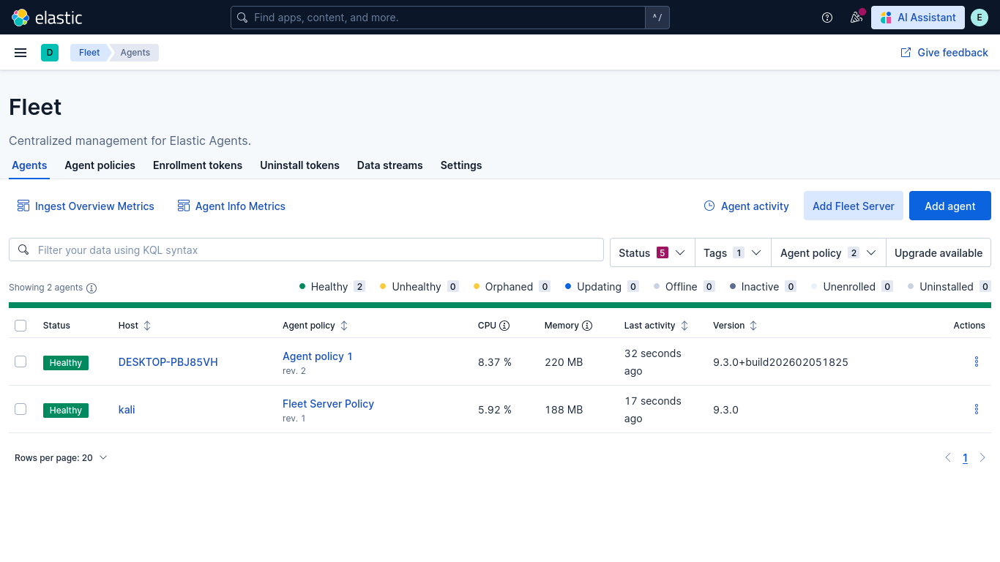

# ELK Deployment & Troubleshooting

---

## 1.ELK Installation on Kali Linux

### 1.1..deb packages & Starting the ELK service

* [**Elasticsearch**](https://www.elastic.co/downloads/elasticsearch)

* [**Kibana**](https://www.elastic.co/downloads/kibana)

* `sudo dpkg -i package_name`

* `sudo systemctl daemon-reload`

* `sudo systemctl enable service_name`

* `sudo systemctl start service_name`

### 1.2.Configuring Elasticsearch and Kibiana

* `sudo ufw allow 5601/tcp`

* `sudo ufw allow 9200/tcp`

* `sudo ufw allow 8220/tcp`

* Elastic search `https://localhost:9200`

* Kibana `http://localhost:5601`

* `sudo /usr/share/elasticsearch/bin/elasticsearch-create-enrollment-token --scope kibana`

* `sudo /usr/share/kibana/bin/kibana-verification-code`

### 1.3.Setting up the Fleet and Agent

* `sudo /usr/share/kibana/bin/kibana-encryption-keys generate` copy paste to `sudo nano /etc/kibana/kibana.yml`

* `sudo systemctl restart kibana`

* Adding the **Kali Linux** as the fleet server

* Adding the **Kali Linux** as the agent `enroll` `--insecure` `sudo systemctl enable elastic-agent` `sudo systemctl restart elastic-agent`

* Adding the **Windows** as the agent `--insecure`

