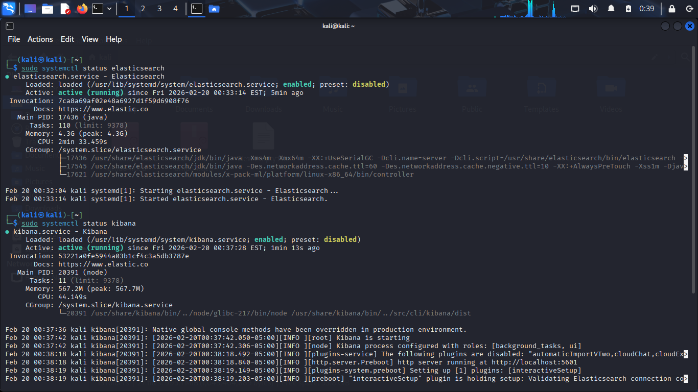
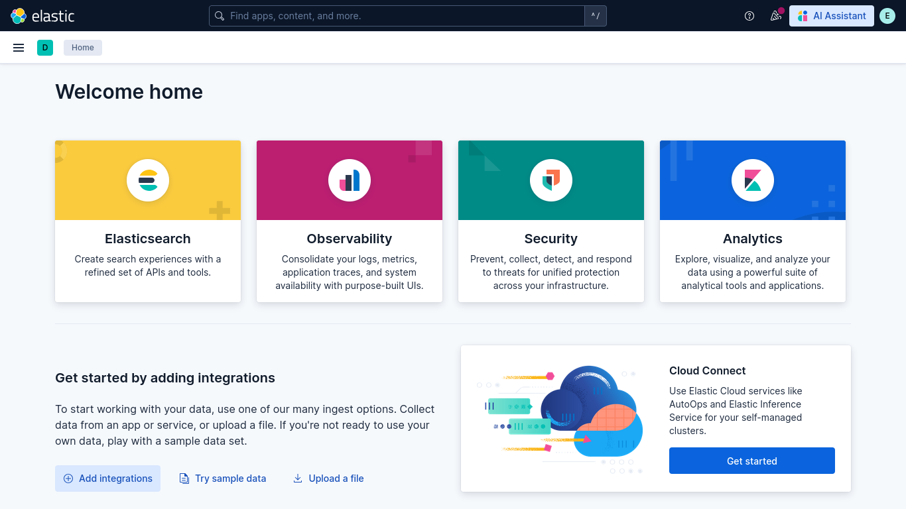
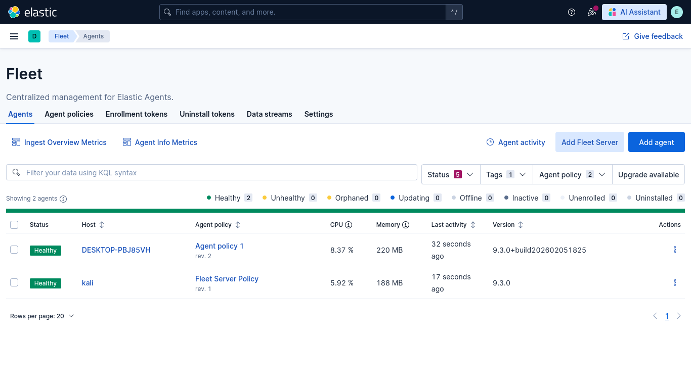
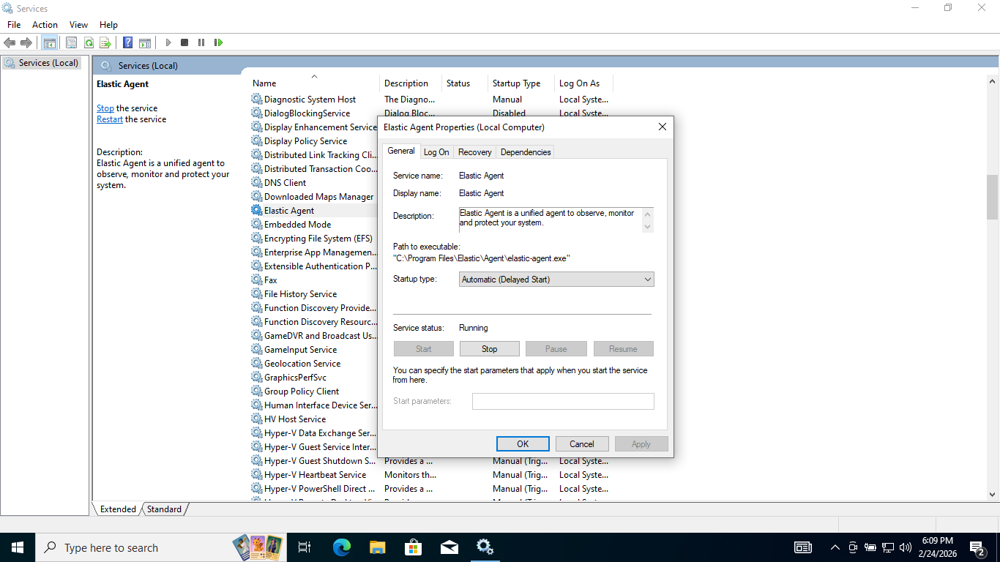
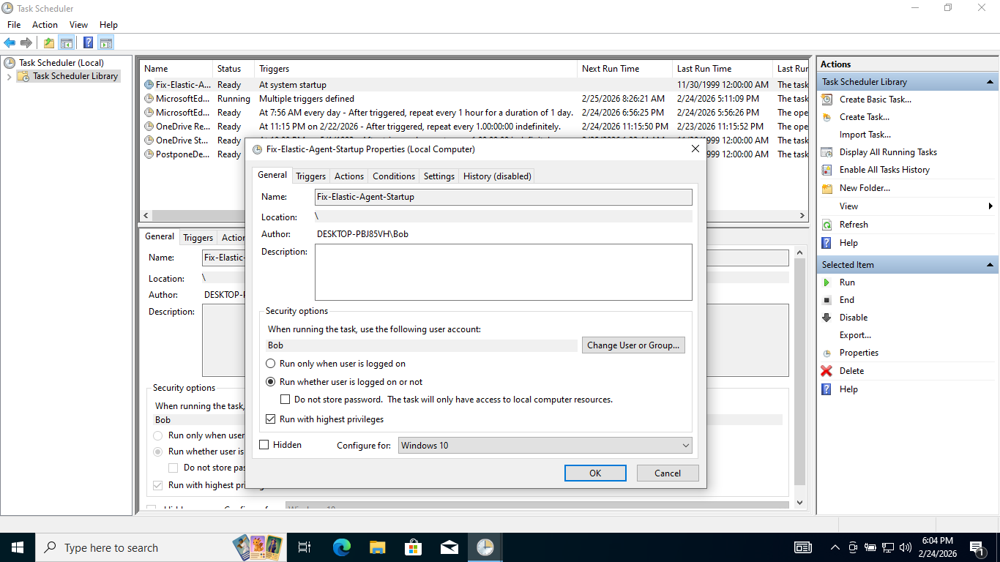
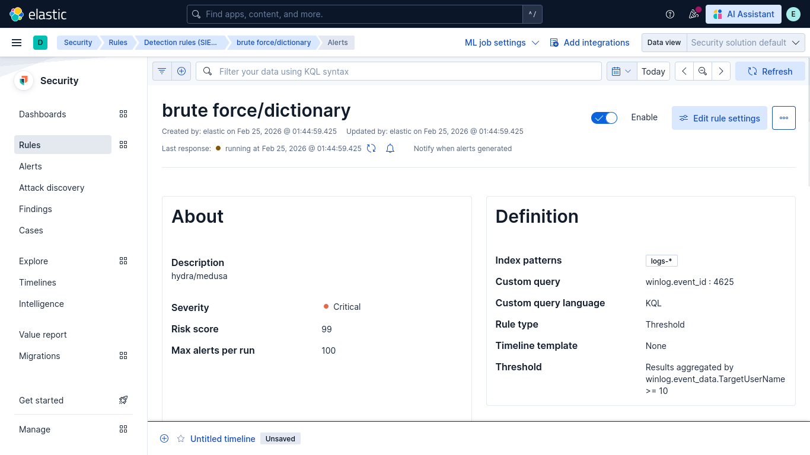
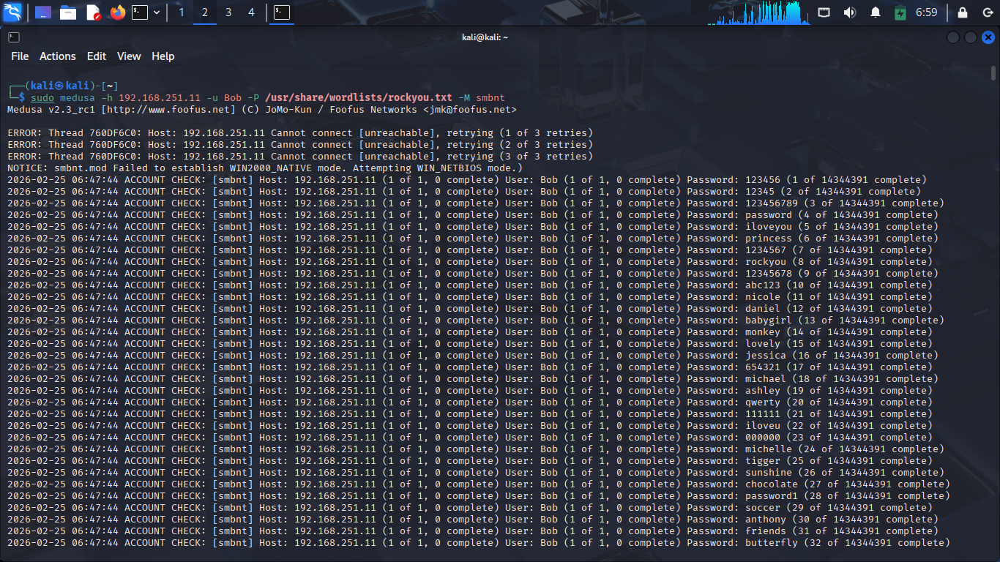
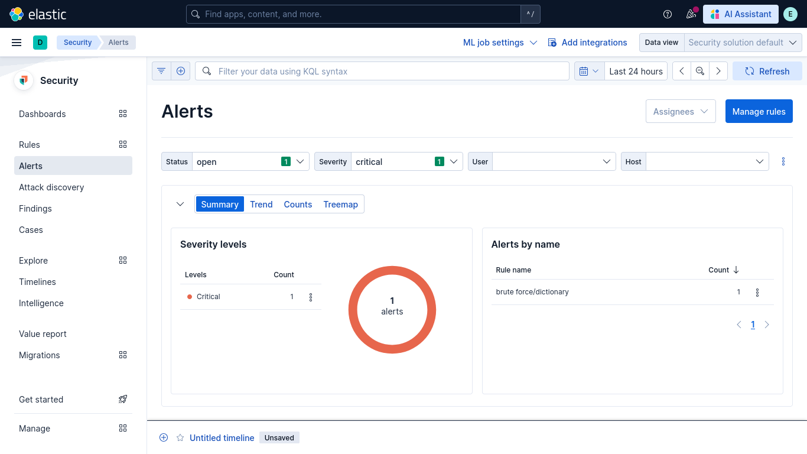
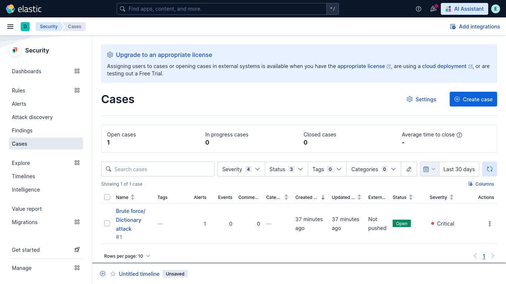
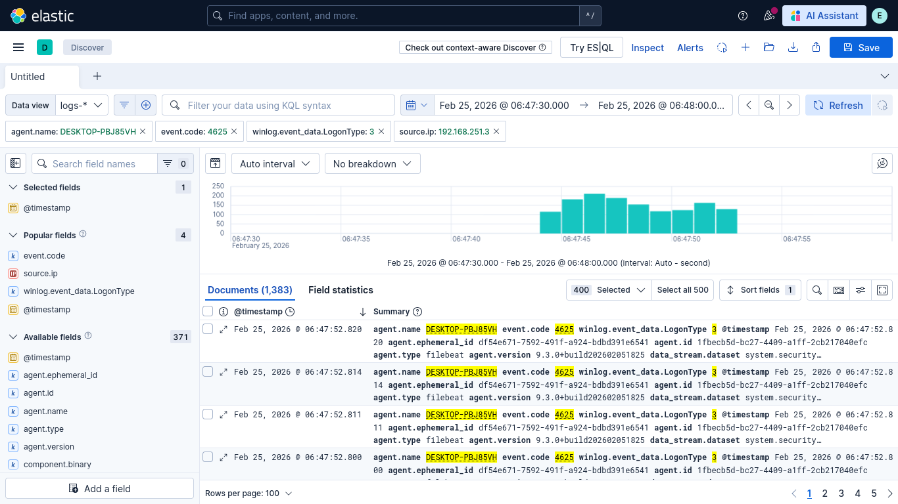

# ELK Deployment & Troubleshooting

---

## 1.ELK Installation on Kali Linux

### 1.1..deb packages & Starting the ELK service

* [**Elasticsearch**](https://www.elastic.co/downloads/elasticsearch)

* [**Kibana**](https://www.elastic.co/downloads/kibana)

* `sudo dpkg -i package_name`

* `sudo systemctl daemon-reload`

* `sudo systemctl enable service_name`

* `sudo systemctl start service_name`

### 1.2.Configuring Elasticsearch and Kibiana

* `sudo ufw allow 5601/tcp`

* `sudo ufw allow 9200/tcp`

* `sudo ufw allow 8220/tcp`

* Elastic search `https://localhost:9200`

* Kibana `http://localhost:5601`

* `sudo /usr/share/elasticsearch/bin/elasticsearch-create-enrollment-token --scope kibana`

* `sudo /usr/share/kibana/bin/kibana-verification-code`

### 1.3.Setting up the Fleet Server and Agent

* `sudo /usr/share/kibana/bin/kibana-encryption-keys generate` copy paste to `sudo nano /etc/kibana/kibana.yml`

* `sudo systemctl restart kibana`

* Adding the **Kali Linux** as the fleet server

* Adding the **Windows** as the agent `--insecure`

* Adding the `windows` integration to the policy: management > fleet > agent policies > windows-policy > add integration > windows

### 1.4.Elastic Agent auto Startup problem in Windows (Troubleshooting)

* **win + r** > Run `services.msc` > Find `Elastic Agent`

* **Elastic Agent** > Right click > Properties > Startup type > `Automatic (delayed)`

*  **Recovery Tab** > Set "First failure" to `Restart the Service` & Set "Second failure" to `Restart the Service`.

* **Powershell** `Get-Service "Elastic Agent"`

* **Powershell** `Restart-Service "Elastic Agent" -Force`

### 1.5.Elastic Agent maual Startup in Windows (Task Scheduler)

* **Task Scheduler Admin**

* **Action** > Create Task

* Select `Run whether user is logged on or not` & Check `Run with highest privileges`

*  **Trigger** > New > Begin the task > `At Startup` & Check `Delay task for 10 minutes`

*  **Action** > New > Program/Script > `powershell.exe` > Add Arugements > `-ExecutionPolicy Bypass -WindowStyle Hidden -Command "Restart-Service 'Elastic Agent' -Force"`

*  **Condition** Uncheck `Start the task only if the computer is on AC power`

*  **Settings** > Check `Run the task as soon as possible after schduled start is missed` & Check `if task fails, restart every: 1 min` & Attempt to restart up to `3 times`

*  _Switch to `At User Logon` if `At Startup` failed in vm_

---

## 2.SIEM Detection Rules

* `curl -X GET "localhost:9200/_cluster/health?pretty"`

* `suod systemctl restart elasticsearch.service`

* `curl -k -u elastic https://localhost:9200`

* _**JvmGcMonitorService** needs more than 8GB of RAM_

### 2.1.Adding Rules for Brute/Dictionary: Failed Logon (4625)

* **Hamburger Menu** > Security >  Rules > Detection Rules (SIEM) > Create New Rules

* **Define Rule** Select `Threshold`

* **Source** `Index Patterns` & Index patterns `logs-*`

* **Custom Query** `winlog.event_id : 4625`

* **Group By** `winlog.event_data.AccountName` & Threshold `10`

* **Name** `Brute Force/Dictionary`

* **Severity** `Critical` & **Risk score** `99`

* **Schduled Run** Runs every `1m` & Additional look-back time `1m`

* **Create & Enable Rule**

---

## 3.SIEM Alert for Detection Rules

### 3.1.Multiple Faild Logons in Windows

**Brute force/Dictionary attack using Medusa**

* Executed the command `sudo medusa -h 192.168.251.11 -u Bob -P /usr/share/wordlists/rockyou.txt -M smbnt` targeting SMB to trigger the alert in ELK.

**SIEM Alert**

* SIEM Dashboard detected the alert for the multiple failed login attempts (4625) in Windows VM.

* **Hamburger Menu** > Security >  Alerts > SIEM Dashboard

**Creating New Case for the Alert**

* Security > Cases > Add to new cases

**Discover**

* `agent.name:` 

* `event.code:`

* `winlog.event_data.LogonType:`

* `source.ip:`

* `@timestamp`

 

