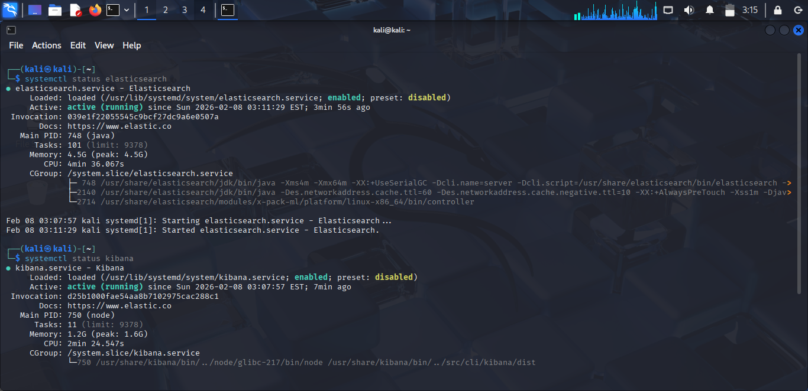
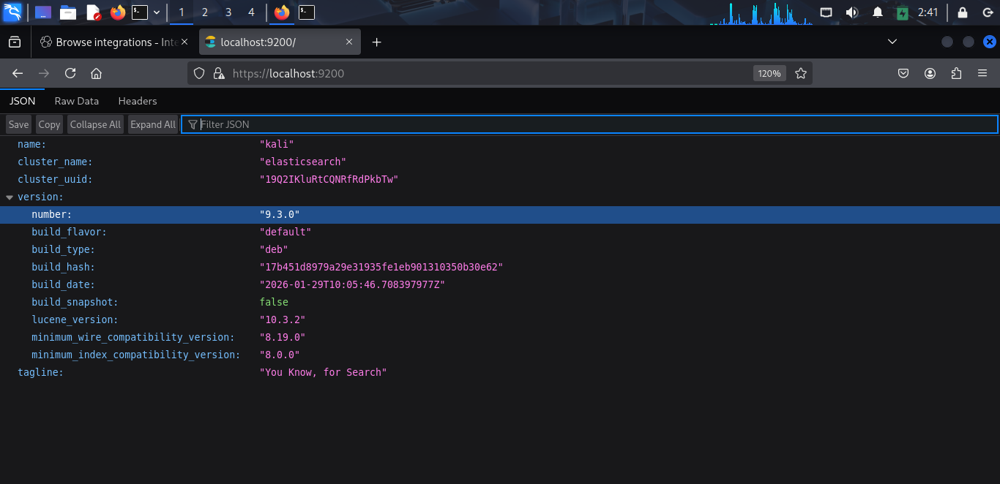
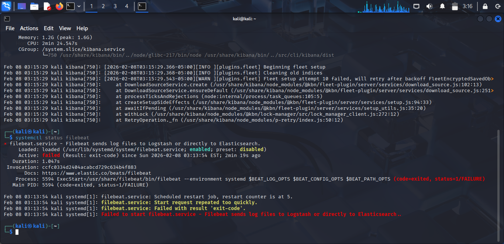
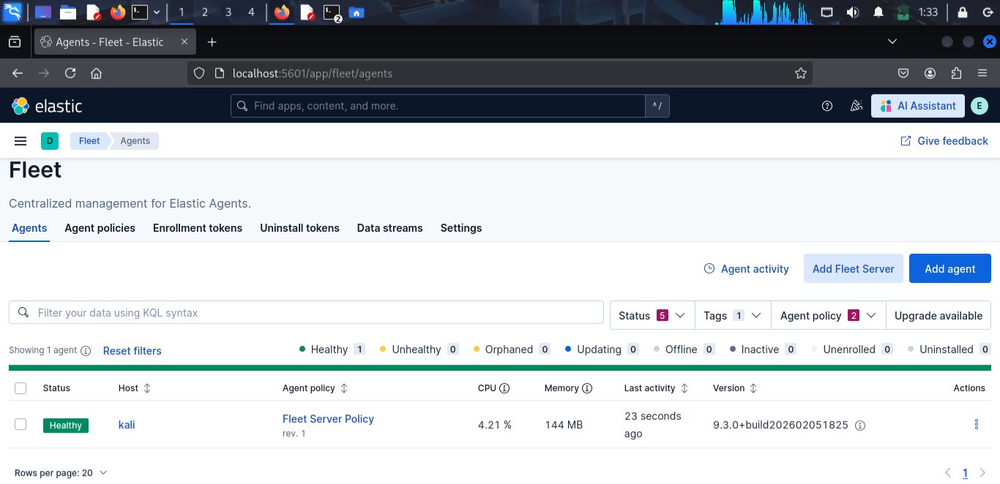

# ELK Deployment & Troubleshooting

---

## 1.ELK Installation on Kali Linux

### 1.1..deb packages & Starting the ELK service

* [**Elasticsearch**](https://www.elastic.co/downloads/elasticsearch)

* [**Kibana**](https://www.elastic.co/downloads/kibana)

* `sudo dpkg -i package_name`

* `sudo systemctl daemon-reload`

* `sudo systemctl enable service_name`

* `sudo systemctl start service_name`

### 1.2.Configuring Elasticsearch and Kibiana

* `sudo ufw allow 5601/tcp`

* `sudo ufw allow 9200/tcp`

* `sudo ufw allow 8220/tcp`

* Elastic search `https://localhost:9200`

* Kibana `http://localhost:5601`

* `sudo /usr/share/elasticsearch/bin/elasticsearch-create-enrollment-token --scope kibana`

* `sudo /usr/share/kibana/bin/kibana-verification-code`

### 1.3.Setting up the Fleet Server and Agent

* `sudo /usr/share/kibana/bin/kibana-encryption-keys generate` copy paste to `sudo nano /etc/kibana/kibana.yml`

* `sudo systemctl restart kibana`

* Adding the **Kali Linux** as the fleet server

* Adding the **Windows** as the agent `--insecure`

* Adding the `windows` integration to the policy: management > fleet > agent policies > windows-policy > add integration > windows

### 1.4.Elastic Agent auto Startup problem in Windows (Troubleshooting)

* **win + r** > Run `services.msc` > Find `Elastic Agent`

* **Elastic Agent** > Right click > Properties > Startup type > `Automatic (delayed)`

*  **Recovery Tab** > Set "First failure" to `Restart the Service` & Set "Second failure" to `Restart the Service`.

* **Powershell** `Get-Service "Elastic Agent"`

* **Powershell** `Restart-Service "Elastic Agent" -Force`

### 1.5.Elastic Agent maual Startup in Windows (Task Scheduler)

* **Task Scheduler Admin**

* **Action** > Create Task

* Select `Run whether user is logged on or not` & Check `Run with highest privileges`

*  **Trigger** > New > Begin the task > `At Startup` & Check `Delay task for 10 minutes`

*  **Action** > New > Program/Script > `powershell.exe` > Add Arugements > `-ExecutionPolicy Bypass -WindowStyle Hidden -Command "Restart-Service 'Elastic Agent' -Force"`

*  **Condition** Uncheck `Start the task only if the computer is on AC power`

*  **Settings** > Check `Run the task as soon as possible after schduled start is missed` & Check `if task fails, restart every: 1 min` & Attempt to restart up to `3 times`

*  _Switch to `At User Logon` if `At Startup` failed in vm_

---

## 2.SIEM Detection Rules

* `curl -X GET "localhost:9200/_cluster/health?pretty"`

* `suod systemctl restart elasticsearch.service`

* `curl -k -u elastic https://localhost:9200`

* _**JvmGcMonitorService** needs more than 8GB of RAM_

### 2.1.Adding Rules for Brute/Dictionary: Failed Logon (4625)

* **Hamburger Menu** > Security >  Rules > Detection Rules (SIEM) > Create New Rules

* **Define Rule** Select `Threshold`

* **Source** `Index Patterns` & Index patterns `logs-*`

* **Custom Query** `winlog.event_id : 4625`

* **Group By** `winlog.event_data.AccountName` & Threshold `10`

* **Name** `Brute Force/Dictionary`

* **Severity** `Critical` & **Risk score** `99`

* **Schduled Run** Runs every `1m` & Additional look-back time `1m`

* **Create & Enable Rule**

---

## 3.SIEM Alert for Detection Rules

### 3.1.Multiple Faild Logons in Windows

**1.Brute force/Dictionary attack using Medusa**

* Executed the command `sudo medusa -h 192.168.251.11 -u Bob -P /usr/share/wordlists/rockyou.txt -M smbnt` targeting SMB to trigger the alert in ELK.

**2.SIEM Alert**

* SIEM Dashboard detected the alert for the multiple failed login attempts (4625) in Windows VM.

* **Hamburger Menu** > Security >  Alerts > SIEM Dashboard

**3.Creating New Case for the Alert**

* Security > Cases > Add to new cases

**4.Discover**

* `agent.name:` 

* `event.code:`

* `winlog.event_data.LogonType:`

* `source.ip:`

* `@timestamp`

 

---

## 4.Lab Reflection: The Reality of Deployment & Troubleshooting

**While the final results show a successful detection, the process of building this lab involved significant trial and error. Below is an honest account of the challenges faced and how they were overcome.**

### 4.1.The "Hidden" Challenges of ELK Deployment

* Setting up the ELK stack was the most time-consuming part of the project. It is rarely as simple as "plug and play."

* **Resource Management:** Initially the system is struggled with the ELK stack crashing on virtual machine. Llearned that Elasticsearch is extremely RAM-hungry and had to reallocate the VM resources to maximun of 11111 MB (11.111 GB) of RAM just to keep the services stable.

* **Host Machine:** To prevent overheat and crash in middle of the work, all the third party proccess and service are terminited using task manager and allocated minium RAM to other VMs and HOST to keep running the ELK stable inside the Kali Linux VM.

* **From Logstash to Filebeat:** Initially, the plan was to use Logstash as the primary ingestion engine. However, during the deployment on the Kali environment, it became clear that Logstash's resource consumption (high Java heap usage) was causing VM to stop responding and service instability. To optimize the lab's performance, the strategic decision made to switch to Filebeat. This provided a "lightweight" alternative for shipping logs directly from system to Elasticsearch.

### 4.2.The Firewall: Restoring Internal Communication

* During the deployment of the ELK stack on the Kali VM, the System Firewall UFW became a significant blocker for the data pipeline.

* **The Conflict:** Even though the Elasticsearch and Kibana services were technically "running," they were unable to communicate with each other. This resulted in "Connection Refused" errors when attempting to access the Kibana web interface.

* **Fix:** It was the default firewall policy was dropping internal packets. This prevented the Kibana service (port 5601) from querying the Elasticsearch backend (port 9200). And added a new rules of allowing those port to communicate eachother.

### 4.2.The Reality of Troubleshooting: The "Hard Time" with SSL/TLS

* Moving from a simple HTTP connection to a secure HTTPS environment introduced significant technical friction. This is where the majority of the engineering effort was spent.

* **The SSL/TLS Struggle:** Implementing self-signed certificates on the Kali VM was hard. Configuring the Certificate Authority (CA) and ensuring the fingerprints matched across the stack proved difficult, even after successfully switching the stack from HTTP to HTTPS, the Filebeat service became unresponsive.

* **The YAML & API Key Headache:** Configuring the filebeat.yml file required precise syntax. Faced repeated failures where the API Key authentication was rejected by Elasticsearch. Even when the credentials were correct, Later found that API key should not be created manually. It should be generated by the Kibana key generator for API.

* **Connection Breakdown:** Despite the network showing an established connection, the service would "fail instantly" upon startup. This was identified as a handshake failure; Filebeat was refusing to trust the self-signed certificate provided by the Kali VM because the verification_mode wasn't correctly set to certificate or none for the lab environment.

### 4.3.The Final Fix: Practical Approach

* After facing difficulties with manual Filebeat, the deployment strategy was shifted to Elastic Fleet.

* **Fleet Server Deployment:** To bypass the complex manual SSL/TLS handshakes, the Kali VM was configured as a Fleet Server. This centralized the management of policies and certificates, simplifying the secure HTTPS setup.

* **Agent Conflict:** A technical clash was identified when attempting to run both the Fleet Server and the Elastic Agent on the same Kali VM. To resolve this, the Kali VM was dedicated solely as the Fleet Server, and the Elastic Agent was deployed on the Windows target.

* **The "Host-Only" Barrier:** Initially, the Windows Agent failed to communicate with the Fleet Server. The root cause was the Host-Only Adapter restriction. Switching the lab environment to a NAT Network with internet connectivity resolved the routing issues and established the heartbeat.

* **Automating Agent Survival:** A issue was discovered where the Windows Elastic Agent service failed to start automatically after a system reboot. To ensure continuous monitoring, a Manual Task Scheduler entry was created to trigger the service execution upon system startup.

### 4.4.The "Cost" of the Lab: Hardware & Resources

* This project was a rigorous test of both software and hardware.

* **The Snapshot Safety Net:** Over 15 snapshots were utilized to roll back breaking errors during the SSL/TLS and Filebeat Api/Yamal phases. This highlights the "trial and error" nature of security engineering.

* **Physical Limitation:** Operating a full ELK stack in a virtual environment pushed the host's older hardware to its physical limits. Making CPU heat and high memory utilization were observed even during short run-times.

* **Project Conclusion:** Due to the extreme hardware strain and the reduce of host disk space, the project was ended after the successful execution of the Rule and Dictionary attacks. Cleaned up all the snapshots and started the lab fresh to countinue the Wazuh and Open VAS. 

---

## 5.Final Lab Summary

**Despite the hardware limits, the main goal of the lab was reached. The attack was successfully carried out, the data flow was secured using HTTPS and Fleet, and the logs were all collected in one place. This project proves that a SOC Analyst must act as a Security Researcher, a Systems Engineer, and a Hardware Specialist all at once.**

