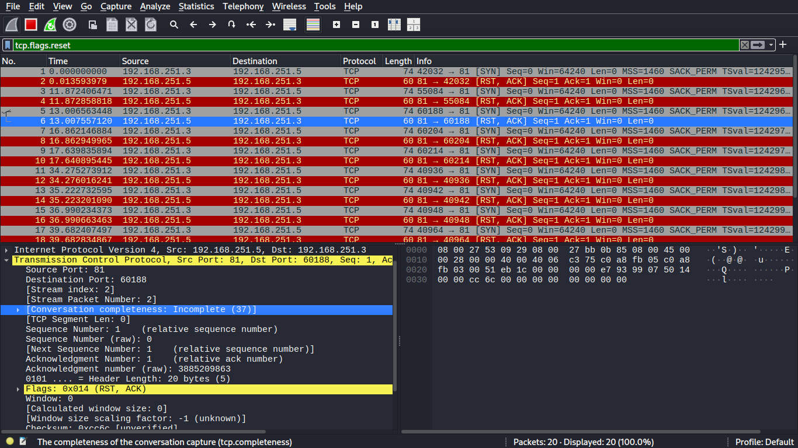

# Wireshark Packet Analysis

---
## 1.ICMP Traffic Capture

### 1.1.Action

* Wireshark capture filter `icmp`

* **ICMP request:** Pinging from kali linux `192.168.251.3` to metasploitable `192.168.251.5` 

### 1.2.Observation
This capture verifies successful bidirectional communication between the Kali Linux attacker (192.168.251.3) and the metasploitable target (192.168.251.5). The presence of matching ICMP Type 8 (Request) and Type 0 (Reply) packets confirms that the network path is clear and the target is reachable for further security testing.

### 1.3.Result

* **Success Rate:** 20 packets transmitted, 20 received, 0% packet loss, time 19443ms

[**ICMP**](./pcap_files/icmp.pcapng)

---

## 2.TCP Three-Way Handshake 

### 2.1.Action

* Wireshark capture filter `tcp port http`

* Wireshark display filter `tcp.flags.syn == 1 && tcp.flags.ack == 1`, `tcp.flags.syn == 1 || tcp.flags.ack == 1`

* **3-way-handshake:** Visiting the DVWA in metasploitable `http://192.168.251.5:80` in firefox browser

### 2.2.Observation

* This capture demonstrates the fundamental SYN -> SYN ACK -> ACK sequence required to establish a reliable connection over TCP.

* **Packet 1 (SYN):** The Attacker sends a synchronization request to the target on Port 80.

* **Packet 2 (SYN-ACK):** The Target responds, acknowledging the request and sending its own synchronization signal.

* **Packet 3 (ACK):** The Attacker sends the final acknowledgment, moving the connection state to established.

### 2.3.Result

* The handshake completed in 3 packets with a total time of only a few milliseconds.

[**TCP-3-way**](./pcap_files/tcp.pcapng)

---

## 3.TCP Three-Way Handshake Fail

### 3.1.Action

* Wireshark capture filter `tcp port 81`

* Wireshark display filter `tcp.flags.reset == 1`

* **3-way-handshake fail:** Making connection to the metasploitable telnet using port closed port `telnet 192.168.251.5:81`

### 3.2.Observation

* **Connection Termination:** Only two packets exist in the entire conversation. The target sends a Reset (RST) flag immediately after your SYN, which kills the connection instantly without completing the three-way handshake.

* **Packet 1 (SYN):** The Attacker sends a synchronization request to the target on Port 81.
 
* **Packet 2 (RST, ACK):** The Target responds by acknowledging (ACK) request but simultaneously sending a Reset (RST) flag. This tells machine to "Stop" because the port is closed.

### 3.3.Result

* The connection was "Refused" because the port is closed.

* The RST-ACK is an "Active No." It tells the attacker (or user) that the machine is online, but the specific service they are looking for is not running.

[**TCP-3-way-fail**](./pcap_files/tcpfail.pcapng)

---

