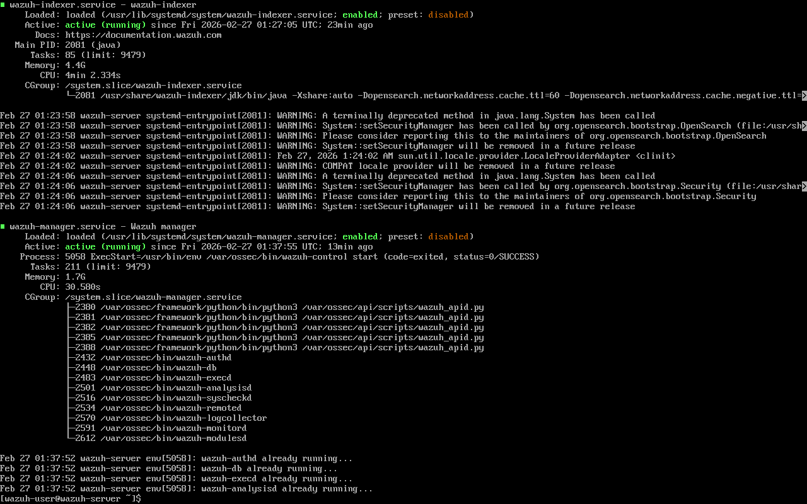
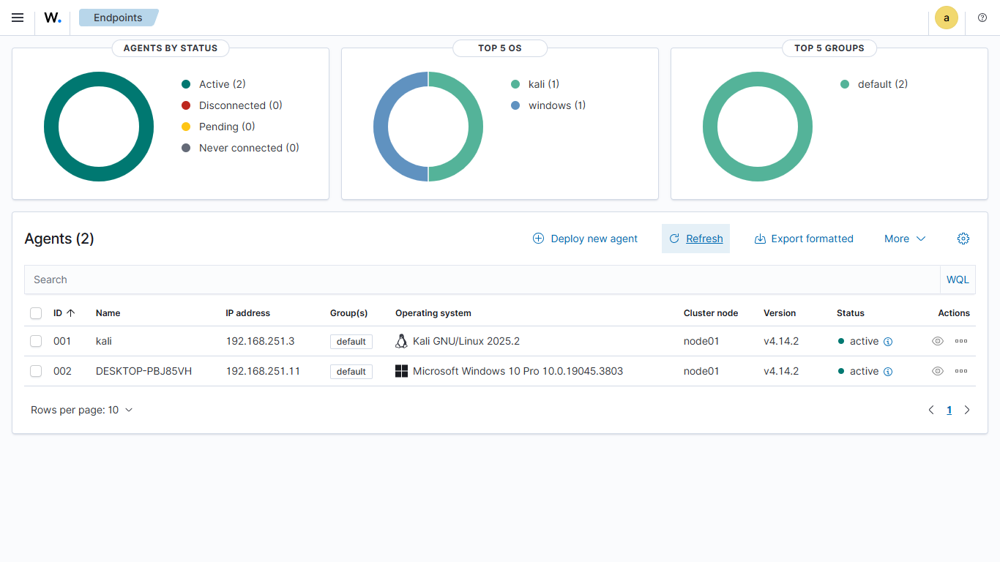
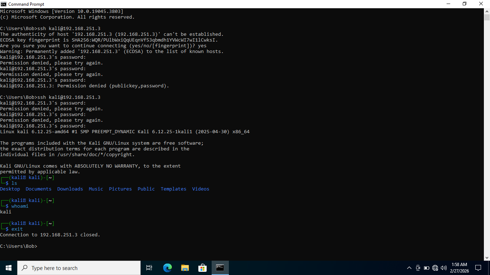
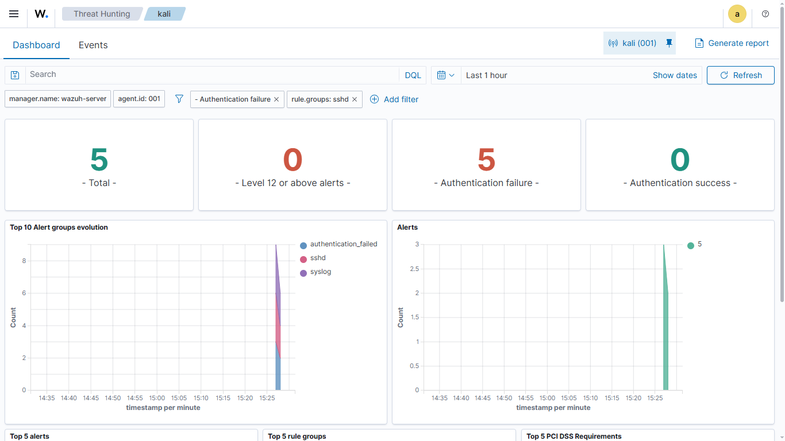
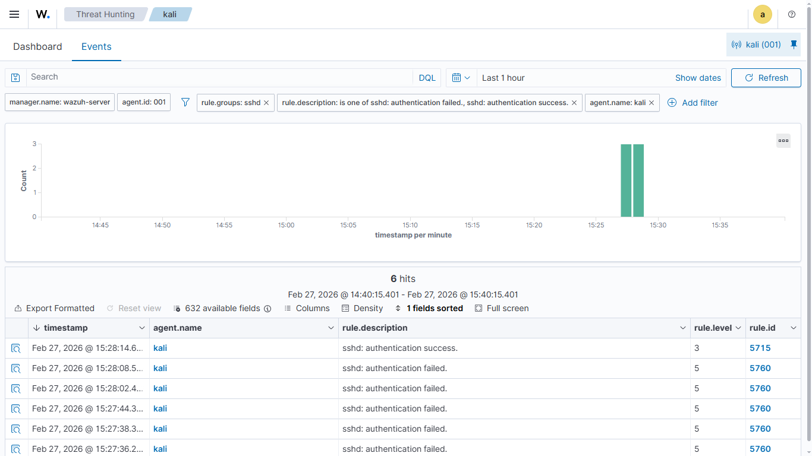
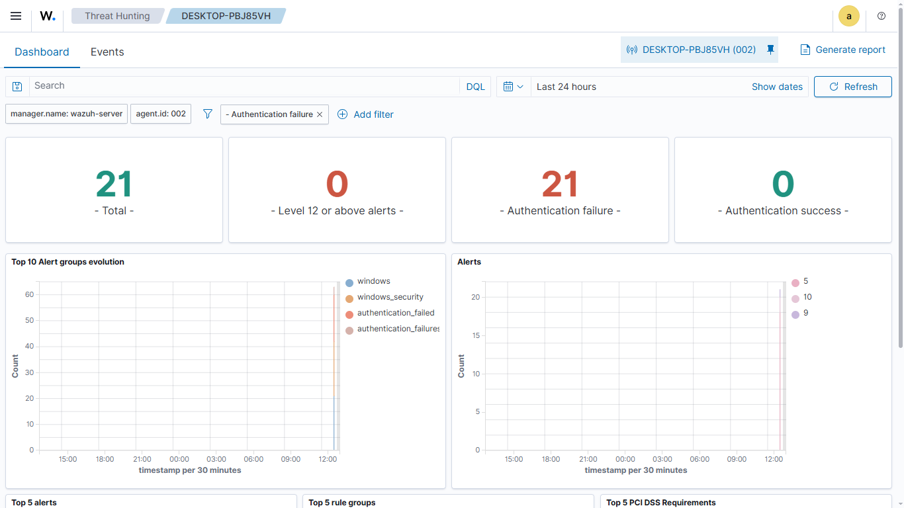
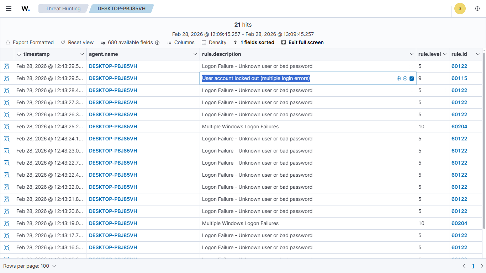
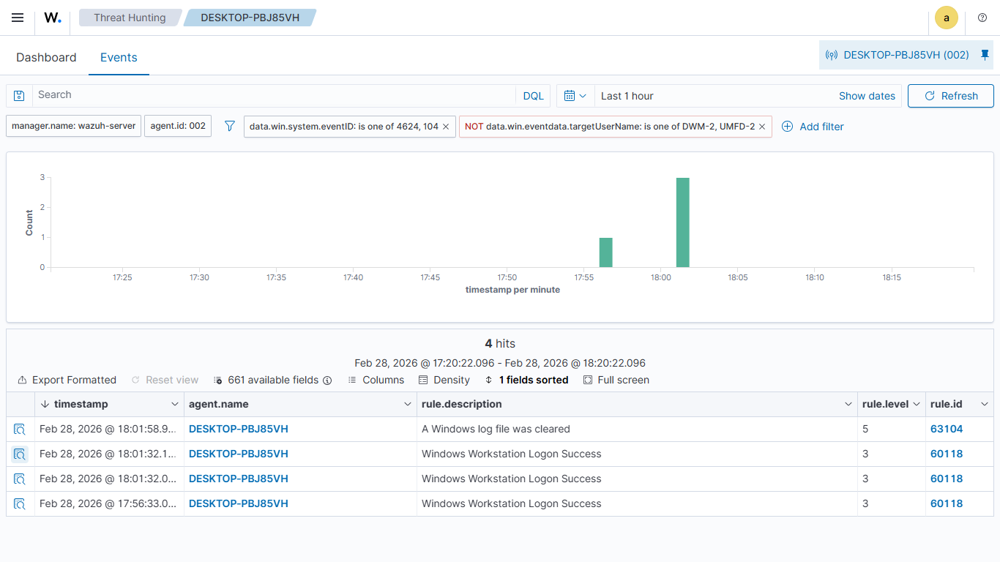

# Wazuh Deployment & Alert Validation

---

## 1.Wazuh HIDS Deployment and OVA Integration

### 1.1.Virtual Box Config

* **Wazuh:** https://documentation.wazuh.com/current/deployment-options/virtual-machine/virtual-machine.html

* **Network:** eth0 "Host-only adapter"

* **Network:** eth1 "Nat network"

*  _**Uncheck cable enable**, wazuh need working internet connection. Huge database for Wazuh-manager is not required in small lab environment._

*  **RAM Allocation:** 8GB

### 1.2.Wazuh Setup: Starting Services and Configuring the Manager

* **User name:** `wazuh-user`

* **Password:** `wazuh`

* `sudo systemctl status wazuh-indexer wazuh-manager wazuh-dashboard`

* `sudo systemctl restart wazuh-indexer`

* `sudo systemctl restart wazuh-manager`

* `sudo systemctl restart wazuh-dashboard`

### 1.3.Multi-Platform Agent Enrollment: Onboarding Windows and Kali Linux Endpoints

* **Deploy new agent**

* **Linux** & **Windows** `DEB amd64` & `MSI 32/64 bits`

* **Assign a server address:** `192.168.251.13` _(Wazuh IP)_

* _Install the wazuh agent in the system_

* **Linux:** `sudo systemctl daemon-reload && sudo systemctl enable wazuh-agent && sudo systemctl start wazuh-agent` _(Bash Shell)_

* **Windows:** `WIN START Wazuh` _(Powershell)_

---

## 2.Login Alerts

### 2.1.False Positive: Multiple Login Failed SSH

**1.Setting up the SSH in Kali Linux**

* `sudo apt install openssh-server -y`

* `sudo systemctl enable --now ssh`

**2.Login via SSH through Windows**

* **CMD:** `ssh kali@192.168.251.3`

**3.Alert Triggered on SIEM Dashboard**

**4.Looking up the events to veriy the alert**

* The sequence of five authentication failures followed immediately by a successful login validates this activity as a false positive, characterizing routine user error rather than a malicious brute-force attempt.

* [**False Positive Report**](./report/events-2026-02-27T10_05_22.351Z.csv)

### 2.3.True positive: RDP Dictionary attack

**1.Setting up the RDP in Windows**

* **Turn on the RDP connection in windows:** Settings > System > Remote Desktop

* _For the lab demonstration "Require computers to use Network Level Authentication (NLA) to connect" has been turned off_

**2.Making sure the windows to collect the log**

* **Powershell:** `auditpol /set /subcategory:"Logon" /success:enable /failure:enable`

* _By default, Windows is often "quiet" it might not log every failed password attempt. This command forces it to speak up so that Wazuh Agent can "hear" what is happening and report it to dashboard._

**3.Running a Dictionary attack using hydra**

* `sudo hydra -l Bob -P /usr/share/wordlists/rockyou.txt -t 1 192.168.251.11 rdp -vV`

**4.Checking the alert on SIEM Dashboard**

* The presence of a final logon failure (Rule 60122) just 4 milliseconds after the account lockout event (Rule 60115) confirms an automated brute-force attack, as the attacker's parallel threads continued to hit the service even after the security policy had successfully locked the account."

* [**True Positive Report**](./report/events-2026-02-28T07_42_37.205Z.csv)

### 2.4.Suspicious User Login: Insider Threat

* **Standard user:** Alice logged in outside of the office hour

* Executed powershell command with admin rights `wevtutil cl System`

* A successful Privilege Escalation and Obfuscation attempt was identified; by using administrative credentials to execute wevtutil, the insider (Alice) attempted to delete system audit trails—an action immediately flagged by Wazuh as a high-severity tactical alert.

* [**Insider Threat Report**](./report/events-2026-02-28T12_51_08.497Z.csv)

---

## 3.Real-time Detection of Unauthorized File Modifications (FIM)

### 3.1.Configuring the "Watchdog"

### 3.2.The "Detection" Simulation

